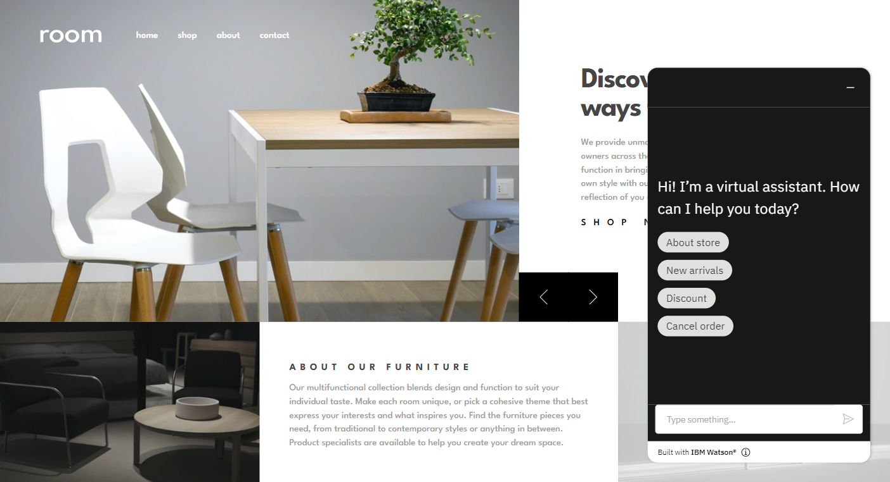

# Room homepage

This is a solution to the [Room homepage challenge on Frontend Mentor](https://www.frontendmentor.io/challenges/room-homepage-BtdBY_ENq).

## Table of contents

- [Overview](#overview)
  - [The challenge](#the-challenge)
  - [Screenshot](#screenshot)
  - [Links](#links)
- [My process](#my-process)
  - [Built with](#built-with)
- [Author](#author)

## Overview

### The challenge

Users should be able to:

- View the optimal layout for the site depending on their device's screen size
- See hover states for all interactive elements on the page
- Navigate the slider using either their mouse/trackpad or keyboard

### Screenshot

### Links

- Solution URL: [Frontend Mentor](https://www.frontendmentor.io/solutions/room-homepage-react-tailwindcss-CE9DqmrRO0)
- Live Site URL: [Room Homepage](https://room-homepage-flax.vercel.app/)

## My process

### Built with

- Mobile-first workflow
- Semantic HTML5 markup
- TailwindCSS
- Framer Motion
- React

## Author

- Frontend Mentor - [@adityaphasu](https://www.frontendmentor.io/profile/adityaphasu)
